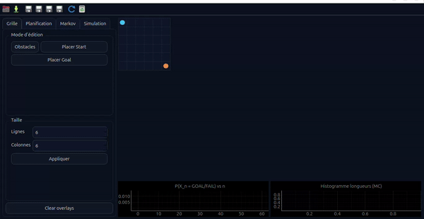

# 🎓 Mini-Projet Bases IA — Planification Robuste sur Grille (A* + Chaînes de Markov)

> **Projet académique** — Implémentation d'algorithmes de recherche (A\*, UCS, Greedy) couplés à une modélisation stochastique par chaînes de Markov sur une grille 2D, avec interface graphique interactive.

---

## 📽️ Démo vidéo



*L'application GUI en action : édition de grille interactive, exécution pas-à-pas de A\*, construction de la chaîne de Markov, visualisation du heatmap de π(n) et simulation Monte Carlo avec graphiques temps réel.*

**🎬 Autres formats :**
- **[MP4](mini_projet_astar_markov_gui_v3_full/video/demo_gui.mp4)** (648 Ko, haute qualité)
- **[WebM](mini_projet_astar_markov_gui_v3_full/video/demo_gui.webm)** (166 Ko, original)

---

## 📑 Table des matières

- [Aperçu du projet](#-aperçu-du-projet)
- [Architecture du dépôt](#-architecture-du-dépôt)
- [Pipeline de traitement](#-pipeline-de-traitement)
- [Fonctionnalités](#-fonctionnalités)
- [Installation](#-installation)
- [Utilisation](#-utilisation)
  - [Expériences en ligne de commande](#1-expériences-en-ligne-de-commande-notebook)
  - [Interface graphique (GUI)](#2-interface-graphique-gui)
- [Description des expériences](#-description-des-expériences)
- [Détail des modules](#-détail-des-modules)
- [Concepts théoriques](#-concepts-théoriques)
- [Résultats](#-résultats)
- [Technologies utilisées](#-technologies-utilisées)

---

## 🔬 Aperçu du projet

Ce mini-projet explore la **planification de trajectoire** sur une grille 2D avec obstacles, en combinant :

1. **Algorithmes de recherche** — A\*, UCS (Dijkstra), Greedy Best-First, Weighted A\*
2. **Extraction de politique** — Conversion du chemin optimal en politique d'actions (U/D/L/R/S)
3. **Modélisation stochastique** — Construction d'une chaîne de Markov intégrant un bruit de glissement ε
4. **Analyse probabiliste** — Calcul de π(n), courbes d'absorption P(GOAL) / P(FAIL)
5. **Simulation Monte Carlo** — Validation empirique par simulation d'épisodes

Le projet est livré sous **deux formes** :
- Un **module Python + Jupyter Notebook** pour les expériences reproductibles (E1–E4)
- Une **application GUI interactive** (PySide6/Qt) pour l'exploration visuelle

---

## 📁 Architecture du dépôt

```
repo_projet/
│
├── code_avec_notebook/                    # Module Python + Notebook
│   ├── astar.py                           # Algorithmes de recherche (UCS, Greedy, A*, Weighted A*)
│   ├── grid.py                            # Modèle de grille 2D
│   ├── heuristics.py                      # Heuristiques (h_zero, Manhattan)
│   ├── markov.py                          # Chaîne de Markov (matrice P, π(n), absorption)
│   ├── policy.py                          # Extraction de politique depuis un chemin
│   ├── simulation.py                      # Simulation Monte Carlo
│   ├── experiments.py                     # Expériences E1–E4 (CSV + figures)
│   ├── notebook_mini_projet_astar_markov.ipynb  # Notebook Jupyter interactif
│   ├── requirements.txt
│   ├── figures/                           # Figures générées (PNG)
│   └── results/                           # Résultats CSV + grilles JSON
│
├── mini_projet_astar_markov_gui_v3_full/  # Application GUI interactive
│   ├── app/
│   │   ├── main.py                        # Fenêtre principale (PySide6, thème dark Fusion)
│   │   ├── P_matrix.csv                   # Exemple de matrice de transition exportée
│   │   ├── model/                         # Logique métier
│   │   │   ├── astar.py                   # A* avec support animation pas-à-pas
│   │   │   ├── grid.py                    # Grille interactive (toggle obstacles, resize)
│   │   │   ├── markov.py                  # Markov sparse/dense avec heatmap
│   │   │   ├── policy.py                  # Politique d'actions
│   │   │   └── simulation.py             # Monte Carlo avec histogramme
│   │   └── ui/                            # Composants graphiques
│   │       ├── grid_widget.py             # Widget de rendu de grille (heatmap, animation)
│   │       └── plots.py                   # Graphiques pyqtgraph (courbes, histogrammes)
│   ├── video/                             # Vidéo de démonstration
│   │   └── Capture vidéo du 2026-03-05 22-56-40.webm
│   ├── requirements.txt
│   └── README.md
│
└── README.md                              # ← Ce fichier
```

---

## ⚙️ Pipeline de traitement

```
┌──────────┐     ┌──────────┐     ┌──────────┐     ┌──────────────┐     ┌────────────┐
│  Grille  │────▶│ Recherche│────▶│ Politique │────▶│ Chaîne de    │────▶│ Analyse /  │
│  2D      │     │ A*/UCS/  │     │ (U/D/L/R) │     │ Markov (P,ε) │     │ Simulation │
│          │     │ Greedy   │     │           │     │              │     │ Monte Carlo│
└──────────┘     └──────────┘     └──────────┘     └──────────────┘     └────────────┘
       │                                                    │                   │
       │                                              ┌─────┴─────┐       ┌─────┴─────┐
       │                                              │ π(n)      │       │ Taux      │
       │                                              │ P(GOAL)   │       │ succès    │
       │                                              │ P(FAIL)   │       │ Temps moy.│
       │                                              └───────────┘       └───────────┘
```

---

## ✨ Fonctionnalités

### Algorithmes de recherche
| Algorithme | Fonction d'évaluation | Optimalité |
|---|---|---|
| **UCS** (Uniform-Cost Search) | f(n) = g(n) | ✅ Optimal |
| **Greedy Best-First** | f(n) = h(n) | ❌ Non optimal |
| **A\*** | f(n) = g(n) + h(n) | ✅ Optimal (h admissible) |
| **Weighted A\*** | f(n) = g(n) + w·h(n) | ⚠️ w-optimal |

### Heuristiques supportées
| Heuristique | Formule | Comportement |
|---|---|---|
| `h_zero` | h = 0 | Transforme A\* en UCS |
| `manhattan` | \|r₁ - r₂\| + \|c₁ - c₂\| | Admissible et consistante (grille 4-connexe) |

### Modélisation Markov
- Construction de la **matrice de transition P** (dense ou sparse)
- Paramètre **ε (epsilon)** : probabilité de glissement latéral
  - Avec probabilité (1 - ε) → mouvement dans la direction voulue
  - Avec probabilité ε/2 → glissement perpendiculaire (gauche ou droite)
- États absorbants **GOAL** et **FAIL** (optionnel)
- Calcul de **π(n) = π(0) · Pⁿ** (distribution d'état au pas n)
- **Courbes d'absorption** P(X_n = GOAL) et P(X_n = FAIL)
- **Analyse canonique** : décomposition Q, R, matrice fondamentale N = (I - Q)⁻¹

### Interface graphique (GUI)
- Thème sombre Fusion (palette bleu nuit)
- **Édition interactive** de la grille (obstacles, start, goal, redimensionnement 5×5 à 60×60)
- **Animation pas-à-pas** de l'exploration A\* (vitesse configurable 5–200 ms/pas)
- **Heatmap** de la distribution π(n) sur la grille
- **Graphiques temps réel** : courbes d'absorption + histogramme Monte Carlo
- **Export** : PNG, CSV (matrice P, π(n), courbes), JSON (grilles)
- **Raccourcis clavier** : Ctrl+O (ouvrir), Ctrl+S (sauvegarder), Ctrl+E (exporter)

---

## 🚀 Installation

### Prérequis
- **Python 3.10+**
- pip

### Module Python / Notebook

```bash
cd code_avec_notebook
pip install -r requirements.txt
```

Dépendances : `numpy`, `matplotlib`

### Application GUI

```bash
cd mini_projet_astar_markov_gui_v3_full
pip install -r requirements.txt
```

Dépendances : `pyside6`, `pyqtgraph`, `numpy`

---

## 🖥️ Utilisation

### 1. Expériences en ligne de commande (Notebook)

#### Lancer toutes les expériences (E1–E4)
```bash
cd code_avec_notebook
python experiments.py
```

Les résultats sont générés dans `results/` (CSV + PNG) et `figures/` (graphiques).

#### Utilisation de l'API Python
```python
from grid import Grid
from astar import astar, ucs, greedy
from heuristics import manhattan
from policy import policy_from_path
from markov import build_transition_matrix, pi_n, absorbing_curves
from simulation import monte_carlo

# Créer une grille
grid = Grid(rows=10, cols=10, obstacles={(2,3), (3,3), (4,3)}, start=(0,0), goal=(9,9))

# Recherche A*
result = astar(grid, manhattan)
print(f"Chemin trouvé : {result.path}, Coût : {result.cost}, Nœuds explorés : {result.expansions}")

# Extraire la politique
pol = policy_from_path(result.path)

# Construire la chaîne de Markov (ε = 0.1)
mm = build_transition_matrix(grid, pol, epsilon=0.1, add_fail=True)

# Distribution π(n) au pas 50
pi = pi_n(mm, start=(0,0), n=50)

# Simulation Monte Carlo
stats = monte_carlo(mm, start=(0,0), episodes=5000, max_steps=500)
print(f"Taux de succès : {stats.success_rate:.2%}")
```

#### Jupyter Notebook
```bash
jupyter notebook notebook_mini_projet_astar_markov.ipynb
```

### 2. Interface graphique (GUI)

```bash
cd mini_projet_astar_markov_gui_v3_full
python -m app.main
```

#### Guide rapide de l'interface

| Onglet | Fonctionnalités |
|---|---|
| **Grille** | Choisir le mode d'édition (obstacle/start/goal), redimensionner la grille, effacer les overlays |
| **Planification** | Sélectionner l'algorithme (A\*/UCS/Greedy), lancer la recherche instantanée ou en animation pas-à-pas, construire la politique |
| **Markov** | Régler ε (0–0.60), activer l'état FAIL, choisir dense/sparse, construire la chaîne, visualiser le heatmap π(n) |
| **Simulation** | Configurer les paramètres Monte Carlo (épisodes, pas max, graine), lancer la simulation |

---

## 📊 Description des expériences

### E1 — Comparaison des algorithmes de recherche
Compare **UCS**, **Greedy** et **A\*** sur trois grilles de difficulté croissante (easy 10×10, medium 12×12, hard 15×15). Métriques : succès, coût du chemin, nœuds explorés, taille max de la file, temps d'exécution.

### E2 — Impact du bruit ε
Pour ε ∈ {0.0, 0.1, 0.2, 0.3} sur la grille easy :
- Construit la chaîne de Markov avec état FAIL
- Trace les courbes P(GOAL) et P(FAIL) sur un horizon de 200 pas
- Lance 3000 épisodes Monte Carlo
- Exporte les matrices de transition P

**Observation clé** : plus ε augmente, plus P(GOAL) diminue et P(FAIL) augmente.

### E3 — Comparaison des heuristiques
Compare A\* avec `h_zero` (équivalent UCS) et `manhattan` sur la grille hard. Démontre l'impact de l'heuristique sur le nombre de nœuds explorés.

### E4 — Weighted A\* (optionnel)
Teste des poids w ∈ {1.0, 1.5, 2.0}. Un poids plus élevé accélère la recherche au détriment de l'optimalité du chemin.

---

## 🧩 Détail des modules

### `grid.py` — Modèle de grille
- Grille 2D avec obstacles, position de départ et objectif
- Voisinage 4-connexe (haut, bas, gauche, droite)
- Sérialisation JSON pour sauvegarde/chargement

### `astar.py` — Moteur de recherche
- Framework unifié **Best-First Search** paramétré par la fonction d'évaluation
- `SearchResult` : chemin, coût, expansions, taille max de OPEN, temps d'exécution
- Version GUI : stocke l'ordre d'exploration pour l'animation

### `heuristics.py` — Fonctions heuristiques
- `h_zero(p, goal)` → 0 (dégénère en UCS)
- `manhattan(p, goal)` → |Δr| + |Δc| (admissible pour grille 4-connexe)

### `policy.py` — Extraction de politique
- Convertit un chemin [p₀, p₁, ..., pₙ] en dictionnaire {position → action}
- Actions : U (haut), D (bas), L (gauche), R (droite), S (stay/goal)

### `markov.py` — Chaîne de Markov
- Construit la matrice P à partir de la politique et du paramètre ε
- Gère les états absorbants GOAL et FAIL
- Calculs : Pⁿ, π(n), courbes d'absorption, analyse canonique (N, Q, R)

### `simulation.py` — Monte Carlo
- Échantillonnage de trajectoires sur la chaîne de Markov
- Agrégation : taux de succès/échec, nombre moyen de pas

### `experiments.py` — Orchestrateur
- Génère les grilles (easy, medium, hard)
- Exécute E1–E4 et sauvegarde les résultats en CSV + PNG

---

## 📐 Concepts théoriques

### Algorithme A\*
L'algorithme A\* explore les nœuds par ordre de f(n) = g(n) + h(n), où :
- **g(n)** est le coût réel du chemin depuis le départ
- **h(n)** est une estimation heuristique du coût restant

Avec une heuristique **admissible** (h(n) ≤ coût réel) et **consistante**, A\* garantit un chemin optimal.

### Chaîne de Markov avec glissement
Le paramètre **ε** modélise l'incertitude d'exécution. À chaque pas :

$$
P(\text{mouvement voulu}) = 1 - \varepsilon
$$
$$
P(\text{glissement latéral}) = \frac{\varepsilon}{2} \text{ (chaque côté)}
$$

Si le mouvement résultant mène à un obstacle ou hors limites :
- **Sans FAIL** : l'agent reste sur place
- **Avec FAIL** : l'agent transite vers un état absorbant FAIL

### Distribution d'état
La distribution au pas n se calcule par :
$$
\pi(n) = \pi(0) \cdot P^n
$$

### Matrice fondamentale
Pour l'analyse des chaînes absorbantes, on décompose P en forme canonique :
$$
P = \begin{pmatrix} Q & R \\ 0 & I \end{pmatrix}
$$
La matrice fondamentale **N = (I - Q)⁻¹** donne le nombre moyen de visites de chaque état transitoire.

---

## 📈 Résultats

### Figures générées

| Figure | Description |
|---|---|
| `figures/grids_overview.png` | Vue d'ensemble des trois grilles (easy, medium, hard) |
| `figures/E1_comparison.png` | Comparaison des algorithmes de recherche |
| `figures/E2_curves_combined.png` | Courbes d'absorption combinées pour différents ε |
| `figures/E2_mc.png` | Résultats Monte Carlo par ε |
| `figures/E4_weighted.png` | Impact du poids w sur Weighted A\* |
| `figures/P_heatmap_eps01.png` | Heatmap de la matrice P (ε = 0.1) |
| `figures/architecture.png` | Schéma d'architecture du système |

### Fichiers CSV

| Fichier | Contenu |
|---|---|
| `results/E1_search_comparison.csv` | Métriques UCS/Greedy/A\* par grille |
| `results/E2_eps_impact.csv` | Métriques Monte Carlo par ε |
| `results/E2_P_eps_*.csv` | Matrices de transition pour chaque ε |
| `results/E3_heuristics.csv` | Comparaison h_zero vs Manhattan |
| `results/E4_weighted_astar.csv` | Résultats Weighted A\* |
| `results/grid_*.json` | Grilles sérialisées (easy, medium, hard) |

---

## 🛠️ Technologies utilisées

| Technologie | Usage |
|---|---|
| **Python 3.10+** | Langage principal |
| **NumPy** | Calcul matriciel (Pⁿ, π(n)) |
| **Matplotlib** | Graphiques pour les expériences |
| **PySide6 (Qt6)** | Interface graphique |
| **PyQtGraph** | Graphiques temps réel dans la GUI |
| **Jupyter Notebook** | Exploration interactive |

---

## 📄 Licence

Projet académique — usage éducatif uniquement.

---

<p align="center">
  <i>Développé dans le cadre du cours de Bases de l'Intelligence Artificielle</i>
</p>
